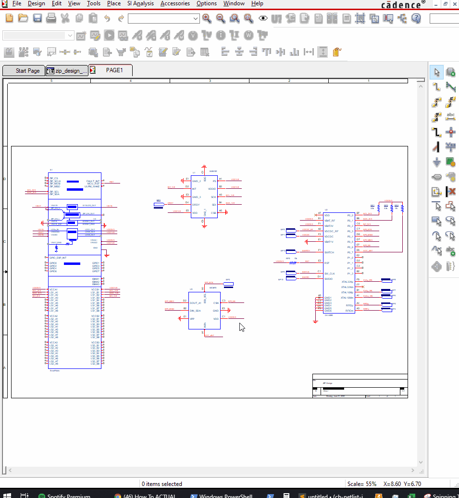

zGlue Netlist Generator for OrCAD
*********************************

Version: 1.0.0

Author(s): Jorge L. Rojas

zGlue Inc, 883 N Shoreline Blvd, C200, Mountain View, CA 94043, USA

Contact: jorge@zglue.com

*Released under zOH License v. 1.0 for distribution and open-source development*

Overview
========

This repository contains a TCL script that generates a valid SPICE netlist from an OrCAD schematic that can be directly imported in ChipBuilder, an OrCAD ChipBuilder symbol library, and an example OrCAD schematic with it's importable netlist. Besides having a working example system that can be used to test the schematic import process, the repository also serves as a template and tutorial for creating ZIP-based schematics with OrCAD's schematic capture tool. The TCL script, ChipBuilder symbol library, and example schematic files in this repository are being released by zGlue Inc under the zGlue Open Hardware V1 license.

Creating a Schematic
====================

To create a schematic, simply add the ``CHIPBUILDER_SYMBOLS.OLB`` library into your OrCAD project, populate one ``SMART-FABRIC`` part instance, and wire-up your schematic. Use the ``BONDPAD`` symbol to specify which nets should be exposed as ZIP package pins. For more information on how to create your ZIP schematic, please visit `zGlue University <https://zglue.com/university>`_ for in-depth tutorials.

Generating the Netlist
======================

Once the OrCAD schematic is completed, click "View" -> "Command Window". Then, enter the following commands on the interactive TCL shell, replacing the ``<...>`` with the appropriate arguments:

.. code-block:: tcl
    
    source <"path\\to\\capNetGen.tcl">
    capNetGen::generateNetlist <design_name.dsn> <"netlist\\system_name.cir">

The GIF below shows this process from OrCAD Capture.

.. note::

    Keep the double quotes and backslashes on arguments specifying a path to escape the backslash characters correctly.

Netlist Import Specification
============================

For a complete specification of the ChipBuilder symbols library and the SPICE netlist format, please read the detailed `specification in this repository <https://github.com/zglue/cb-netlist-import>`_.

What's Included?
================

* TCL script for generating SPICE netlist
* zGlue's ChipBuilder symbols OrCAD library
* OrCAD example project and design files
* SPICE netlist example generated from schematic
* zGlue Open Hardware License V1 (zOH V1 License)
